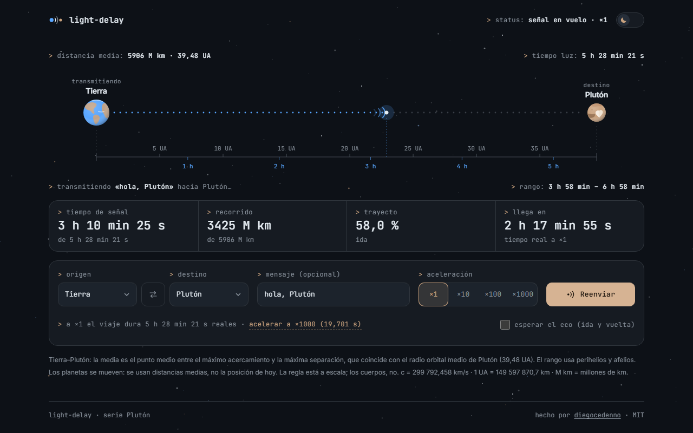

# light-delay

> How long does a message take? Pick an origin and a destination in the solar system and watch the signal cross a to-scale ruler in the real travel time of light.
>
> ¿Cuánto tarda un mensaje? Elige origen y destino en el sistema solar y mira la señal cruzar una regla a escala en el tiempo real que tarda la luz.

**[Live demo · Demo en vivo →](https://diegocedenno.github.io/light-delay/)**

**[English](#english)** · **[Español](#español)**

---

## English

### What it does

- Choose origin and destination among Earth, the Moon, Mars, Jupiter, Pluto and Voyager 1, type an optional message and press send.
- A pulse leaves the origin and travels along a dotted path at constant speed. At ×1 it takes exactly as long as light does: 1.28 s to the Moon, 12 min 40 s to Mars, almost a day to Voyager 1.
- Counters show signal time, distance covered, percentage of the trip and the real time left. When the pulse lands, the destination acknowledges the message; optionally the echo comes back for the round trip.
- ×10, ×100 and ×1000 speed things up, even mid-flight. If a trip would take long, the page says how long and offers the acceleration that fixes it.
- The last route, acceleration and echo setting survive a reload (`localStorage`).
- A switch in the header flips between dark and light mode: the same sky redrawn as a star chart on paper, with the bodies, the probe and the signal inked to read on it. The choice is remembered and shared across the Plutón series.

### What makes it technically interesting

- **Timestamps, not frames.** Signal time is `banked + (now − since) × acceleration`. The animation loop only reads that value, so a five-hour trip to Pluto at ×1 survives a background tab or a closed laptop lid: when you come back the pulse is where it should be. Changing the acceleration mid-flight just banks the elapsed signal time and restarts the count.
- **Honest distances.** Planets move, so the page states what it uses: the midpoint between closest approach and farthest separation, which equals the semi-major axis of the outer body, plus the real min–max range from perihelia and aphelia. Voyager 1 does not orbit, so its distance is computed for today's date, including where Earth is on its orbit.
- **A ruler that is actually to scale.** Distance ticks (km or AU) and light-time ticks (seconds, minutes, hours or days) are generated from "nice" steps and fitted to the available width, so labels never collide from 360 px to 1920 px.
- **Text that never shrinks.** The SVG viewBox matches the container in pixels and the scene is rebuilt on resize, so labels stay at their real size on a phone.
- **Transforms and opacity only.** Per frame, the pulse gets a `transform` and only the dots it has just passed change class. Frame times stay flat at 60 fps.
- **Reduced motion is a first-class path.** With `prefers-reduced-motion` there is no travelling pulse and no frame loop: the dotted path fills in with fades like a progress bar while the counters keep ticking.
- **Native, accessible controls.** Real `select`, radio and checkbox inputs, a form you can submit with `Enter`, visible focus, 44 px touch targets and live regions for the acknowledgement.
- **Zero dependencies, zero build.** Plain HTML, CSS and JavaScript. Fonts are bundled; nothing is requested from the network.

### Reference values

One-way light time with the distances the page uses (c = 299 792.458 km/s, 1 AU = 149 597 870.7 km).

| Route | Distance | Light time | Range |
| --- | --- | --- | --- |
| Earth → Moon | 384 400 km | 1.282 s | 1.19 – 1.36 s |
| Earth → Mars | 1.524 AU | 12 min 40 s | 3 – 22 min |
| Earth → Jupiter | 5.204 AU | 43 min 16 s | 33 – 54 min |
| Earth → Pluto | 39.48 AU | 5 h 28 min | 3 h 58 min – 6 h 58 min |
| Earth → Voyager 1 | ≈ 172 AU (October 2026) | ≈ 23 h 53 min | grows about 3.6 AU a year |

The Voyager 1 model is a straight line: 167.5 AU from the Sun in mid-2025, moving away at 3.57 AU per year. It puts the probe one light-day from Earth in mid-November 2026.

### Run it

Double-click `index.html`. That is all — there is no build step and no server.
It also works as-is on GitHub Pages.

### License

[MIT](LICENSE) © Diego Cedeño. Inter and JetBrains Mono are bundled under the [SIL Open Font License](assets/fonts/).

---

## Español

### Qué hace

- Elige origen y destino entre la Tierra, la Luna, Marte, Júpiter, Plutón y Voyager 1, escribe un mensaje opcional y pulsa enviar.
- Un pulso sale del origen y recorre una trayectoria punteada a velocidad constante. A ×1 tarda exactamente lo que tarda la luz: 1,28 s hasta la Luna, 12 min 40 s hasta Marte, casi un día hasta Voyager 1.
- Los contadores muestran el tiempo de señal, la distancia recorrida, el porcentaje del trayecto y el tiempo real que falta. Cuando el pulso llega, el destino acusa recibo del mensaje; si quieres, el eco vuelve para completar la ida y vuelta.
- ×10, ×100 y ×1000 aceleran el viaje, también en pleno vuelo. Si un envío va a tardar mucho, la página dice cuánto y ofrece la aceleración que lo arregla.
- La última ruta, la aceleración y la opción de eco sobreviven a una recarga (`localStorage`).
- Un interruptor en la cabecera alterna entre modo oscuro y claro: el mismo cielo redibujado como carta estelar sobre papel, con los cuerpos, la sonda y la señal entintados para leerse en él. La elección se recuerda y se comparte entre los proyectos de la serie Plutón.

### Qué lo hace interesante técnicamente

- **Marcas de tiempo, no frames.** El tiempo de señal es `acumulado + (ahora − desde) × aceleración`. El bucle de animación solo lee ese valor, así que un viaje de cinco horas a Plutón a ×1 aguanta una pestaña en segundo plano o un portátil cerrado: al volver, el pulso está donde debe. Cambiar la aceleración en pleno vuelo solo guarda lo acumulado y vuelve a contar.
- **Distancias honestas.** Los planetas se mueven, así que la página dice qué usa: el punto medio entre el máximo acercamiento y la máxima separación, que coincide con el semieje mayor del cuerpo exterior, más el rango real mínimo–máximo a partir de perihelios y afelios. Voyager 1 no orbita, así que su distancia se calcula para la fecha de hoy, incluida la posición de la Tierra en su órbita.
- **Una regla que de verdad está a escala.** Las marcas de distancia (km o UA) y las de tiempo-luz (segundos, minutos, horas o días) salen de pasos "redondos" y se ajustan al ancho disponible, de modo que las etiquetas nunca se pisan entre 360 y 1920 px.
- **Texto que nunca encoge.** El viewBox del SVG mide lo mismo que el contenedor en píxeles y la escena se redibuja al cambiar de tamaño, así las etiquetas conservan su tamaño real en un móvil.
- **Solo transforms y opacidad.** En cada frame el pulso recibe un `transform` y solo cambian de clase los puntos que acaba de pasar. Los frames se mantienen estables a 60 fps.
- **El movimiento reducido es un camino de primera clase.** Con `prefers-reduced-motion` no hay pulso viajando ni bucle de frames: la trayectoria punteada se va encendiendo con fundidos, como una barra de progreso, mientras los contadores siguen corriendo.
- **Controles nativos y accesibles.** `select`, radios y casilla de verdad, un formulario que se envía con `Enter`, foco visible, objetivos táctiles de 44 px y regiones vivas para el acuse.
- **Cero dependencias, cero build.** HTML, CSS y JavaScript sin más. Las fuentes van incluidas; no se pide nada a la red.

### Valores de referencia

Tiempo de luz de ida con las distancias que usa la página (c = 299 792,458 km/s, 1 UA = 149 597 870,7 km).

| Ruta | Distancia | Tiempo luz | Rango |
| --- | --- | --- | --- |
| Tierra → Luna | 384 400 km | 1,282 s | 1,19 – 1,36 s |
| Tierra → Marte | 1,524 UA | 12 min 40 s | 3 – 22 min |
| Tierra → Júpiter | 5,204 UA | 43 min 16 s | 33 – 54 min |
| Tierra → Plutón | 39,48 UA | 5 h 28 min | 3 h 58 min – 6 h 58 min |
| Tierra → Voyager 1 | ≈ 172 UA (octubre de 2026) | ≈ 23 h 53 min | crece unas 3,6 UA al año |

El modelo de Voyager 1 es una línea recta: 167,5 UA del Sol a mediados de 2025, alejándose 3,57 UA por año. Sitúa la sonda a un día-luz de la Tierra a mediados de noviembre de 2026.

### Cómo correrlo

Doble clic en `index.html`. Nada más: no hay build ni servidor.
También funciona tal cual en GitHub Pages.

### Licencia

[MIT](LICENSE) © Diego Cedeño. Inter y JetBrains Mono se incluyen bajo la [SIL Open Font License](assets/fonts/).
